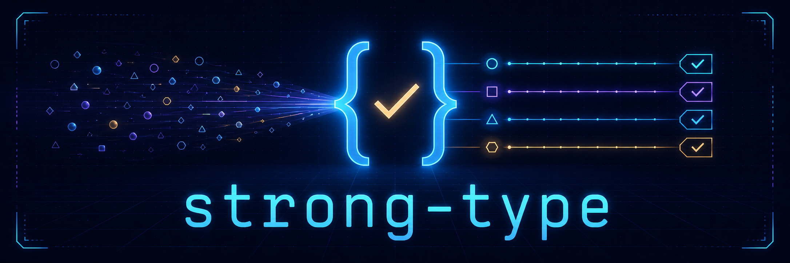

# strong-type

[Documentation and live playground](https://riaevangelist.github.io/strong-type/)

[](https://www.npmjs.com/package/strong-type) [](https://www.npmjs.com/package/strong-type) [](https://github.com/RIAEvangelist/strong-type/actions/workflows/ci.yml) [](./licence) [](./package.json)

Native type enforcement for JavaScript. `strong-type` runs as the same untransformed ES module in browsers and Node. Strict checks throw a useful `TypeError`; non-strict checks return a boolean.

## Native by design

| Property | Guarantee | What it means |
|---|---|---|
| Module format | Native ESM | The checked-in JavaScript is what the runtime executes. |
| Runtime dependencies | None | No third-party production packages. |
| Development dependencies | None | Tests and the local docs server use Node built-ins. |
| Bundler | Not required | Browser and Node imports work directly. |
| Transpiler | Not required | No generated CommonJS or compatibility copy. |
| Default entry point | Isomorphic | `index.js` contains no `node:*` imports. |
| Node support | Explicit adapter | `strong-type/node` adds Node-only precision checks. |
| Extensibility | Exported `Is` class | Custom validators work directly and in unions. |

## Install

```console
npm install strong-type
```

| Import | Runtime | Contents | Build required |
|---|---|---|---|
| `strong-type` | Browser + Node | All isomorphic and guarded host validators | No |
| `strong-type/index.js` | Browser + Node | Compatibility path to the same core | No |
| `strong-type/node` | Node | Core plus Node built-ins and exact `util.types` checks | No |
| `strong-type/node.js` | Node | Compatibility path to the Node adapter | No |

## Quick start

```js
import Is from 'strong-type';

const is=new Is;
const weakIs=new Is(false);

is.string('strong-type');        // true
weakIs.number('42');             // false
is.union(new Map,'map|set');     // true

is.number('42');                 // throws TypeError
```

## Strict and non-strict modes

| Mode | Create | Passing check | Failing check | Best use |
|---|---|---|---|---|
| Strict | `new Is` or `new Is(true)` | Returns `true` | Throws `TypeError` | Contracts and enforcement |
| Non-strict | `new Is(false)` | Returns `true` | Returns `false` | Branching and type discovery |

Every advertised method exists in every runtime. When a guarded platform capability is unavailable, strict mode throws `TypeError` and non-strict mode returns `false`. Missing APIs never leak a `ReferenceError`.

## Validator reference

The default isomorphic entry exposes 183 validators. The Node adapter adds 18, for 201 documented validators total. The [website reference](https://riaevangelist.github.io/strong-type/#types) gives every method its own searchable row with an example, edge case, and runtime label.

### Values, primitives, and numbers

| Methods | What passes | Important detail |
|---|---|---|
| `defined`, `any`, `exists` | Anything except `undefined` | `null` is defined. |
| `null` | Exactly `null` | No loose comparison; `undefined` fails. |
| `nullish` | `null` or `undefined` | Other falsy values fail. |
| `undefined` | Exactly `undefined` | `null` fails. |
| `boolean` | Primitive booleans | Boxed Boolean objects fail. |
| `bigInt`, `bigint` | Primitive bigint values | `bigint` is the lowercase alias. |
| `number` | Primitive numbers | Includes `NaN` and infinities. |
| `finite`, `finiteNumber` | Finite primitive numbers | Strings, `null`, and BigInt are not coerced. |
| `integer` | Integer primitive numbers | `NaN` and infinities fail. |
| `safeInteger` | Safe integer primitive numbers | Uses `Number.isSafeInteger`. |
| `NaN`, `nan` | Exactly numeric `NaN` | No string coercion. |
| `infinity`, `positiveInfinity` | Exactly positive `Infinity` | `infinity` keeps its positive-only compatibility meaning. |
| `negativeInfinity` | Exactly negative `Infinity` | Positive Infinity fails. |
| `infinite` | Either infinity | Finite numbers fail. |
| `negativeZero` | Exactly `-0` | Uses `Object.is`; `+0` fails. |
| `string` | Primitive strings | Boxed String objects fail. |
| `symbol` | Primitive symbols | Boxed Symbol objects fail. |
| `primitive` | `null` or any non-object, non-function value | Boxed primitives and functions fail. |
| `globalThis` | Exactly the current `globalThis` | Host aliases are not substituted. |
| `atomics`, `json`, `math`, `reflect` | Their exact global namespaces | Identity checks, not lookalike objects. |
| `rawJSON` | Values created by `JSON.rawJSON` | Guarded until `JSON.isRawJSON` exists. |

### Objects and collections

| Methods | What passes | Important detail |
|---|---|---|
| `array` | Arrays from any realm | Uses `Array.isArray`. |
| `date` | Date objects from any realm | Invalid dates still pass. |
| `validDate` | Dates with a valid time value | Invalid Date fails. |
| `map`, `weakMap`, `set`, `weakSet` | Their matching collection brands | Native internal-slot probes work across realms. |
| `object` | Values where `typeof value === 'object'` | Compatibility behavior: `null` passes. |
| `nonNullObject` | Non-null object values | Use this for the ordinary meaning of object. |
| `plainObject` | Plain records, including null-prototype records | Arrays and class instances fail. |
| `nullPrototypeObject` | Objects with an exact `null` prototype | Ordinary object literals fail. |
| `argumentsObject` | Function `arguments` objects | Arrays fail. |
| `promise` | Promise instances in the current realm | Structural thenables have a separate check. |
| `thenable` | Objects or functions with a callable `then` | It never invokes `then`. |
| `regExp`, `regexp` | RegExp objects from any realm | `regexp` is the lowercase-p alias. |

### Boxed primitives

| Method | What passes | Primitive near miss |
|---|---|---|
| `boxedPrimitive` | Any boxed Boolean, Number, BigInt, String, or Symbol | `1` |
| `booleanObject` | `Object(true)` | `true` |
| `numberObject` | `Object(1)` | `1` |
| `bigIntObject` | `Object(1n)` | `1n` |
| `stringObject` | `Object('type')` | `'type'` |
| `symbolObject` | `Object(Symbol('type'))` | `Symbol('type')` |

### Functions and protocols

| Methods | What passes | Important detail |
|---|---|---|
| `function`, `callable` | Anything whose `typeof` is `function` | Includes async and generator functions. |
| `asyncFunction` | Async functions | Ordinary functions fail. |
| `generatorFunction` | Generator functions | Generator objects use `generator`. |
| `asyncGeneratorFunction` | Async generator functions | Objects use `asyncGenerator`. |
| `generator`, `asyncGenerator` | Their matching generator iterator objects | Function values fail. |
| `iterator` | Values with a callable `next` | Structural by design. |
| `asyncIterator` | Values with `next` and `Symbol.asyncIterator` | Structural by design. |
| `iterable`, `asyncIterable` | Values with the matching symbol method | Null-safe and getter-safe. |

### Errors

| Methods | What passes | Runtime |
|---|---|---|
| `error` | `Error` instances | Shared |
| `aggregateError` | `AggregateError` instances | Guarded standard |
| `evalError` | `EvalError` instances | Shared |
| `rangeError` | `RangeError` instances | Shared |
| `referenceError` | `ReferenceError` instances | Shared |
| `syntaxError` | `SyntaxError` instances | Shared |
| `typeError` | `TypeError` instances | Shared |
| `URIError`, `uriError` | `URIError` instances | Shared; lowercase alias included |
| `suppressedError` | `SuppressedError` instances | Guarded standard |

### Typed arrays and buffers

| Methods | What passes | Important detail |
|---|---|---|
| `typedArray` | Any typed array | Excludes `DataView`. |
| `arrayBufferView` | Any typed array or `DataView` | Uses `ArrayBuffer.isView`. |
| `bigInt64Array`, `bigUint64Array` | Matching BigInt typed arrays | Exact brand. |
| `float16Array` | `Float16Array` | Guarded on older runtimes. |
| `float32Array`, `float64Array` | Matching float typed arrays | Exact brand. |
| `int8Array`, `int16Array`, `int32Array` | Matching signed integer typed arrays | Exact brand. |
| `uint8Array`, `uint8ClampedArray`, `uint16Array`, `uint32Array` | Matching unsigned integer typed arrays | A Node Buffer is also a Uint8Array. |
| `arrayBuffer` | `ArrayBuffer` | Cross-realm native slot probe. |
| `sharedArrayBuffer` | `SharedArrayBuffer` | Guarded where shared memory is absent. |
| `anyArrayBuffer` | Either buffer kind | Views fail. |
| `dataView` | `DataView` | Typed arrays fail. |
| `resizableArrayBuffer` | Resizable ArrayBuffer values | Fixed buffers fail. |
| `growableSharedArrayBuffer` | Growable SharedArrayBuffer values | Fixed shared buffers fail. |
| `detachedArrayBuffer` | Transferred/detached ArrayBuffer values | The fallback probe is non-destructive. |

### Intl

| Methods | What passes | Availability |
|---|---|---|
| `intlDateTimeFormat` | `Intl.DateTimeFormat` | Shared |
| `intlCollator` | `Intl.Collator` | Shared |
| `intlDisplayNames` | `Intl.DisplayNames` | Guarded |
| `intlListFormat` | `Intl.ListFormat` | Guarded |
| `intlLocale` | `Intl.Locale` | Shared |
| `intlNumberFormat` | `Intl.NumberFormat` | Shared |
| `intlPluralRules` | `Intl.PluralRules` | Shared |
| `intlRelativeTimeFormat` | `Intl.RelativeTimeFormat` | Guarded |
| `intlSegmenter` | `Intl.Segmenter` | Guarded |
| `intlSegments` | Values returned by `segmenter.segment()` | Guarded |
| `intlDurationFormat` | `Intl.DurationFormat` | Guarded |

### Lifetime, resources, and Temporal

| Methods | What passes | Availability |
|---|---|---|
| `finalizationRegistry` | `FinalizationRegistry` objects | Guarded standard |
| `weakRef` | `WeakRef` objects | Guarded standard |
| `disposable` | Values with callable `Symbol.dispose` | Guarded structural protocol |
| `asyncDisposable` | Values with callable `Symbol.asyncDispose` | Guarded structural protocol |
| `disposableStack` | `DisposableStack` objects | Guarded standard |
| `asyncDisposableStack` | `AsyncDisposableStack` objects | Guarded standard |
| `temporalDuration` | `Temporal.Duration` | Guarded standard |
| `temporalInstant` | `Temporal.Instant` | Guarded standard |
| `temporalPlainDate` | `Temporal.PlainDate` | Guarded standard |
| `temporalPlainDateTime` | `Temporal.PlainDateTime` | Guarded standard |
| `temporalPlainMonthDay` | `Temporal.PlainMonthDay` | Guarded standard |
| `temporalPlainTime` | `Temporal.PlainTime` | Guarded standard |
| `temporalPlainYearMonth` | `Temporal.PlainYearMonth` | Guarded standard |
| `temporalZonedDateTime` | `Temporal.ZonedDateTime` | Guarded standard |

### Shared Web APIs

These methods are present on every `Is` instance. The constructor or singleton is resolved through `globalThis` only when the method is called.

| Family | Methods | What passes |
|---|---|---|
| URL | `url`, `urlSearchParams`, `urlPattern` | Matching URL API objects |
| Text | `textEncoder`, `textDecoder`, `textEncoderStream`, `textDecoderStream` | Encoding API objects |
| Data | `domException`, `blob`, `file`, `formData`, `headers`, `request`, `response` | Matching Fetch/data objects |
| Cancellation | `abortController`, `abortSignal` | Matching cancellation objects |
| Events | `event`, `eventTarget`, `customEvent`, `messageEvent`, `closeEvent`, `errorEvent` | Matching event objects |
| Messaging | `broadcastChannel`, `messageChannel`, `messagePort`, `webSocket`, `eventSource` | Matching communication objects |
| Host values | `navigator`, `storage` | The current navigator or a Storage object |
| Readable streams | `readableStream`, `readableStreamDefaultReader`, `readableStreamBYOBReader`, `readableStreamDefaultController`, `readableByteStreamController`, `readableStreamBYOBRequest` | Matching Web Streams objects |
| Writable streams | `writableStream`, `writableStreamDefaultWriter`, `writableStreamDefaultController` | Matching Web Streams objects |
| Transform streams | `transformStream`, `transformStreamDefaultController` | Matching transform objects |
| Queuing | `byteLengthQueuingStrategy`, `countQueuingStrategy` | Matching strategy objects |
| Compression | `compressionStream`, `decompressionStream` | Matching compression objects |
| Crypto | `crypto`, `subtleCrypto`, `cryptoKey` | Current crypto services and keys |
| Performance | `performance`, `performanceEntry`, `performanceMark`, `performanceMeasure`, `performanceObserver`, `performanceObserverEntryList`, `performanceResourceTiming` | Matching performance objects |
| WebAssembly | `webAssemblyModule`, `webAssemblyInstance`, `webAssemblyMemory`, `webAssemblyTable`, `webAssemblyGlobal`, `webAssemblyTag`, `webAssemblyException`, `webAssemblyCompileError`, `webAssemblyLinkError`, `webAssemblyRuntimeError` | Matching WebAssembly objects and errors |

## Core and extension methods

| Method | Result | Purpose |
|---|---|---|
| `throw(valueType,expectedType)` | `false` or throws | Central strict/non-strict failure behavior. |
| `check(value,pass,expectedType)` | `true`, `false`, or throws | Turn a predicate into strong-type behavior. |
| `typeCheck(value,type)` | `true`, `false`, or throws | Validate a `typeof` result. |
| `instanceCheck(value,constructor)` | `true`, `false`, or throws | Validate a custom class or realm-local constructor. |
| `symbolStringCheck(value,type)` | `true`, `false`, or throws | Validate an intrinsic object tag. |
| `compare(value,target,typeName)` | `true`, `false`, or throws | Compare exact identity with `Object.is`. |
| `globalInstanceCheck(value,type)` | `true`, `false`, or throws | Guard and check a named global constructor. |
| `nestedInstanceCheck(value,container,type)` | `true`, `false`, or throws | Guard and check a constructor inside a namespace. |
| `globalValueCheck(value,type)` | `true`, `false`, or throws | Check exact identity with a named global value. |
| `nestedValueCheck(value,container,type)` | `true`, `false`, or throws | Check exact identity with a nested value. |
| `union(value,types)` | `true`, `false`, or throws | Accept one named validator from a pipe string or array. |

## Unions

```js
is.union('type','string|number');
is.union(42,['string','number']);
```

| Behavior | Result |
|---|---|
| Whitespace around pipe names | Trimmed |
| Matching validator | Called once |
| Custom subclass validator | Supported |
| Node adapter validator | Supported through `IsNode` |
| Inherited `Object` method such as `toString` | Rejected |
| Multi-argument helper method | Rejected |

## Node adapter

```js
import IsNode from 'strong-type/node';

const is=new IsNode;

is.buffer(Buffer.from('type'));
is.proxy(new Proxy({},{}));
is.nodeReadable(process.stdin);
```

The adapter imports Node built-ins only. It never enters the default browser-safe import graph.

| Method | What passes | Important detail |
|---|---|---|
| `buffer` | Node Buffer values | A plain Uint8Array fails. |
| `nodeStream` | Any classic Node Stream | Web Streams use the shared validators. |
| `nodeReadable` | Node Readable streams | Duplex and Transform inherit Readable. |
| `nodeWritable` | Node Writable streams | Duplex and Transform inherit Writable. |
| `nodeDuplex` | Node Duplex streams | Plain readable or writable streams fail. |
| `nodeTransform` | Node Transform streams | PassThrough inherits Transform. |
| `nodePassThrough` | Node PassThrough streams | Other transforms fail. |
| `eventEmitter` | Node EventEmitter instances | DOM EventTarget fails. |
| `timeout` | Handles returned by `setTimeout` | Constructor is discovered lazily. |
| `immediate` | Handles returned by `setImmediate` | Constructor is discovered lazily. |
| `keyObject` | Node crypto KeyObject values | Web CryptoKey uses `cryptoKey`. |
| `x509Certificate` | Node X509Certificate objects | Requires a parseable certificate. |
| `proxy` | Proxy values | Exact `util.types.isProxy` check. |
| `moduleNamespaceObject` | Results from `import()` | Exact `util.types` check. |
| `external` | Native external values | Usually supplied by a native addon. |
| `nativeError` | Native Error values | Includes cross-realm errors. |
| `mapIterator` | Native Map iterators | Set iterators fail. |
| `setIterator` | Native Set iterators | Map iterators fail. |

## Direct browser use without bundling

Use a native import map. Serve the files over HTTP; browsers do not load ES modules reliably from `file:` URLs.

```html
<script type="importmap">
    {
        "imports": {
            "strong-type": "./node_modules/strong-type/index.js"
        }
    }
</script>

<script type="module">
    import Is from 'strong-type';

    const is=new Is;
    console.log(is.url(new URL('https://example.com')));
</script>
```

You can also import the source directly from your own path:

```js
import Is from './node_modules/strong-type/index.js';
```

No bundle, transform, runtime shim, or host switch is involved.

## Extend strong-type

```js
import Is from 'strong-type';

class Pizza{}

class MyIs extends Is{
    pizza(value){
        return this.instanceCheck(value,Pizza);
    }
}

const is=new MyIs;

is.pizza(new Pizza);
is.union(new Pizza,'pizza|string');
```

| Extension helper | Use |
|---|---|
| `this.typeCheck(value,'string')` | Custom `typeof` validator |
| `this.instanceCheck(value,Pizza)` | Custom class validator |
| `this.check(value,predicate,'description')` | Any custom predicate with standard strict behavior |
| `this.throw(actual,expected)` | Explicit failure path |

## Corrected exact behavior

Version 2 removes several coercive edge cases while retaining the original method names.

| Check | Old behavior | Current behavior |
|---|---|---|
| `null(undefined)` | Passed through loose equality | Fails |
| `infinity('Infinity')` | Passed through loose equality | Fails |
| `finite('1')` | Passed through global coercive `isFinite` | Fails |
| `finite(null)` | Passed through coercion | Fails |
| `finite(1n)` | Could leak a native error | Returns false or throws strong-type `TypeError` |
| `union(value,' string \| number ')` | Did not trim names | Works |
| `union(value,'toString')` | Could call an inherited method | Rejected |
| Subclass validators in `union` | Lost by constructing base `Is` | Preserved |

## Commands

| Command | What it does | Third-party tooling |
|---|---|---|
| `npm test` | Runs core, Node adapter, and documentation checks | None |
| `npm run test:core` | Runs portable validator regression tests | None |
| `npm run test:node` | Runs Node adapter and cross-realm tests | None |
| `npm run test:docs` | Checks reference completeness and site integrity | None |
| `npm start` | Serves the docs and playground at `http://localhost:8000/` | None |
| `npm run nodeExample` | Runs the Node example | None |

## License

[MIT](./licence) · Roshi _ _
